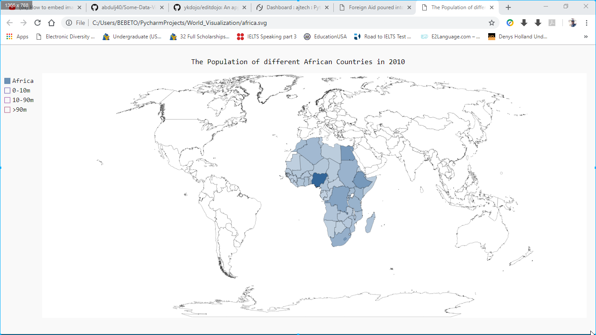
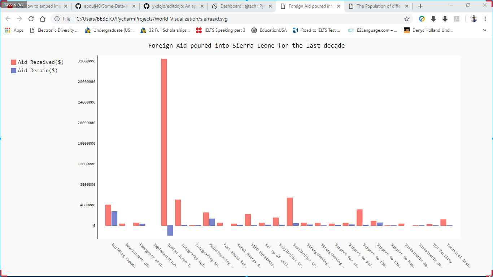
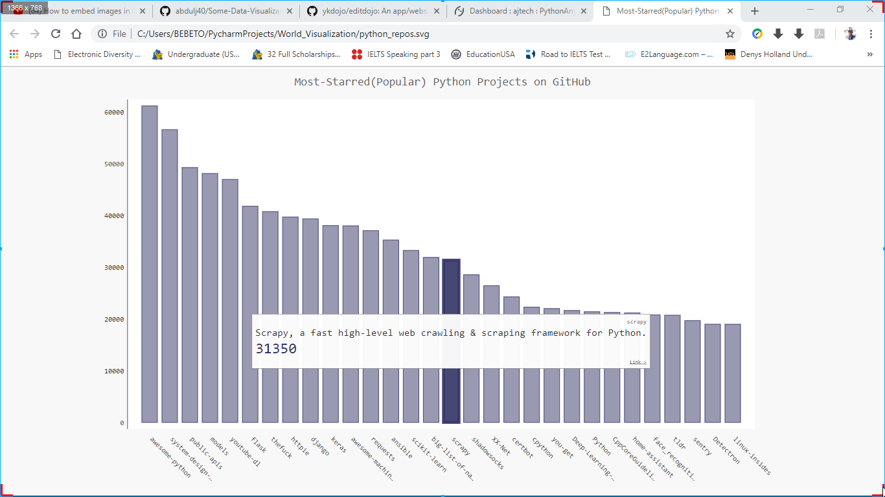
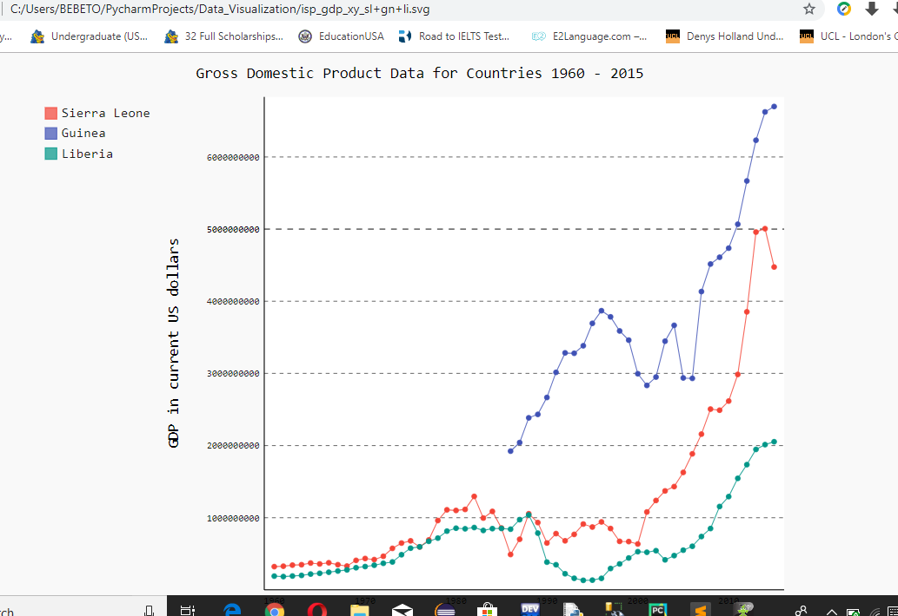

# Some-Data-Visualizations

I created some python data visualizations with the aim of working with external data file in csv, json format to be able
to visualize them real time. This repository contains three of them. They are:

**Africa.py**

This helps to provide a visual output showing the population of different african countries in 2010 and it game me this ouput:

**Output**

when you hover around the country maps, it shows you descriptions of each one with the total population.

**Library used**

1. pygal

I imported pygal's pygal_maps_world.maps which is responsible for the world map you see on the output.
You can use **pip install pygal** in your command line/terminal to install the pygal library to be able to work with this code.

**sierraaid.py**

This helps to give me the Foreign aid Sierra Leone has received for the last decade. It doesn't however account for all as data for Sierra leone is hard to come by on the internet. I downloaded the data file on csv format and worked with it. It game me this ouput in a bar char:

**Output**

when you hover around the bars, it shows you descriptions of each one.

**Libraries used**

1. pygal
2. datetime

I imported pygal to be able to use the bar chart. I also imported datetime and csv modules in order to use the date in the csv file and work with a csv file respectively.

**Python_repo.py**

Python repo is a program that outputs the **most popular python repositories on github** and this is where it got interesting for me. I worked with the python github API which give stats of python repositories on github. The great thing is this programs automatically updates when the python API is updated. Any changes in stats will reflect on the program. This is the output it gave me:

**Output**

As you can see, when you hover around the bars, it shows you descriptions of each one.
when you hover around the country maps, it shows you descriptions of each one with the total population.

**Libraries used**

1. pygal

**Modules**
1. requests

I imported pygal to be able to use the bar chart. I used requests module to be able to request the API from github and save it as json file.
You can use **pip install pygal** in your command line/terminal to install the pygal library or any library to be able to work with this code.

**GDP_line_plot_data.py**

Python file **GDP_line_plot_data.py** with the code for the visualization of GDP data of countries and **isp_gdp_xy_sl+gn+li.svg** showing output in svg format. Data is from a csv file **isp_gdp.csv** collected from the **world bank** website.

**Output**

**Note**
This program enables you to view the GDP data in svg of any country. All you need to do is to change the list in **test_render_xy_plot**
function which has Sierra Leone, Guinea and Liberia to the country of your choice. It returns an empty svg file if there is no GDP data
for that country in the **isp_gdp.csv** file.

**Libraries used**

1. pygal

**Modules**

1. csv

**football_matches.ipynb**

I downloaded a data file in csv format named **results.csv** that records international matches of different countries whether friendly or tournaments, from 1872 to 2019, with the focus of exploration and analysis on the matches played by **Sierra Leone**.
Exploration and visualization of results.csv includes Home wins, Home losses, Home Draws, Away wins, Away losses, Aways for Sierra Leone in a bar chart. Total Matches played by different countries in a bar chart and a whole host of other analysis.

**Outputs**

**Libraries used**

1. pandas
2. matplotlib
3. seaborn
4. pygal

**Module**
1. csv

**Thank You**
